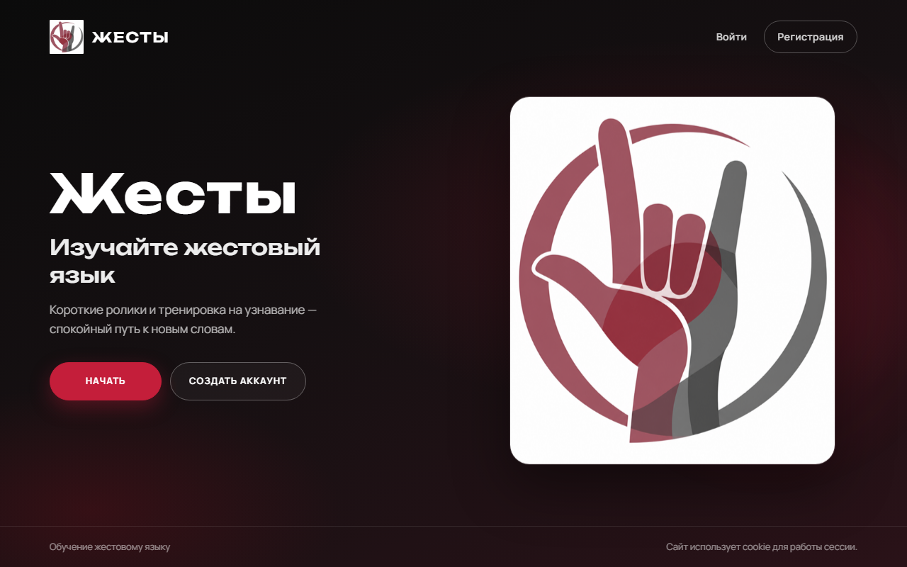
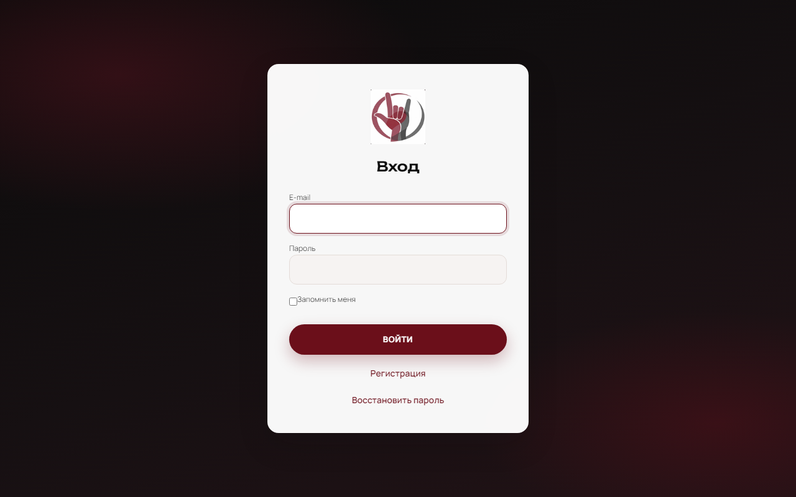
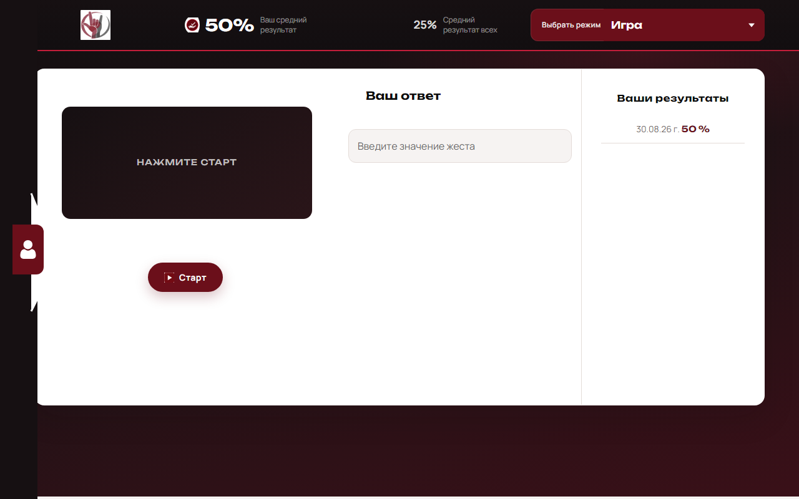

# sign_lang_learner

Веб-приложение для изучения жестового языка: короткие GIF-ролики, режим обучения и игра на узнавание слов.

Стек: **Laravel 6**, **MySQL**, **Docker** (PHP 7.4 + Apache).

## Запуск

```bash
docker compose up -d --build
```

| Сервис     | URL                         |
|------------|-----------------------------|
| Приложение | http://localhost:8000       |
| phpMyAdmin | http://localhost:8081       |

Тестовый админ:

- email: `test@test.test`
- пароль: `password`

## Интерфейс

Главная



Вход



Игра


